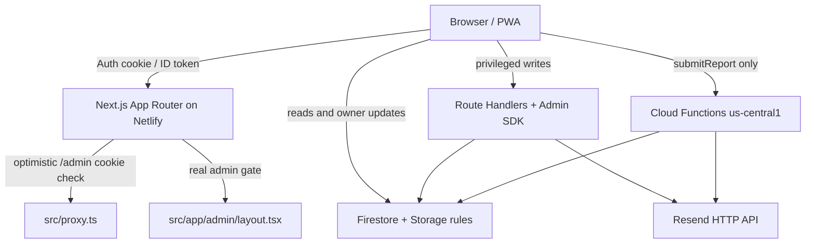

# DroneTag Developer Handover

Technical source of truth for a new programmer. Verified against the current
working tree (not against older audit documents). No secrets are recorded here.

Companion operational docs (not duplicated here):

- [README.md](./README.md) — short landing page and quick start
- [DRONETAG_STAGING_SETUP.md](./DRONETAG_STAGING_SETUP.md) — how to stand up staging
- [docs/DEPLOY_PRODUCTION.md](./docs/DEPLOY_PRODUCTION.md) — production promotion recipe
- [DRONETAG_MANUAL_QA.md](./DRONETAG_MANUAL_QA.md) — functional checklist
- [docs/DEVICE_TESTING.md](./docs/DEVICE_TESTING.md) — real-device checklist
- [DRONETAG_GLOSSARY.md](./DRONETAG_GLOSSARY.md) — pilot vs operator vocabulary
- [DRONETAG_ACCOUNT_DELETION_DESIGN.md](./DRONETAG_ACCOUNT_DELETION_DESIGN.md) — deletion cascade design (not implemented)
- [scripts/README.md](./scripts/README.md) — admin/backfill scripts

---

## 1. Product overview

DroneTag is a web platform for UAS (drone) identification.

An operator stores identity, aircraft, remote-pilot certificates, insurance
policies and permits. An administrator reviews those documents. If the owner
publishes a drone, DroneTag shows a short public card at `/u/{slug}`. A
physical NFC badge is programmed with that URL: anyone who taps the badge sees
who is responsible for the aircraft, whether the certificate and insurance look
valid, and can file a “found drone” report. The owner is notified by email when
Resend is configured.

DroneTag is **not** a payment product, a fleet-management product, or a
hardware encoder. Those surfaces exist as configuration or tooling only.

---

## 2. Current status

**State: PRE-BETA**

Last local verification (2026-09-07, no deploy):

| Check | Result |
|---|---|
| TypeScript | PASS (`npx tsc --noEmit`) |
| Functions | PASS (`cd functions && npm run build`) |
| Unit / integration tests | 106 / 106 |
| Firestore rules tests | 44 / 44 |
| Storage rules tests | 16 / 16 |
| **Total automated tests** | **166 / 166** |
| Lint | 0 errors (11 warnings, exit 0) |
| Production build | PASS |
| Pages emitted by that build | 38 |

**Beta readiness: 73 / 100**  
An invited, named group can sign up, provision an account, manage entities,
publish a public profile, file a found-drone report, open support, and receive
transactional email **if** Firebase rules/functions and Resend are configured
on a non-production project.

**Production readiness: 36 / 100**  
Lower on purpose. Production sale is blocked by work this tree does not
contain: real payments, lawyer-reviewed legal texts, Team/Business tenancy,
automatic account erasure, a verified backup/restore runbook, App Check on the
Next.js path, a separate staging Firebase project actually in use, and
operational tasks only the owner can do (credential rotation, rules deploy,
GitHub visibility). Local test scores do not close those items.

---

## 3. Technology stack

Versions from `package.json` / `package-lock.json` / `functions/package.json`
at the time of writing. Caret ranges may resolve slightly differently after
`npm install`; lockfile versions are listed where they differ from the range.

| Layer | Version | Notes |
|---|---|---|
| Next.js | **16.2.12** (`^16.2.12`) | App Router. `dev` / `build` use **Webpack** (`--webpack`). |
| React / react-dom | **19.2.4** | |
| TypeScript | **5.9.3** (`^5`) | `strict` |
| Tailwind CSS | **4.2.2** (`^4`) + `@tailwindcss/postcss` | Custom UI in `src/components/ui/`. No MUI/Chakra. |
| Firebase client | **^12.11.0** | Auth, Firestore, Storage, Functions, App Check |
| Firebase Admin | **^14.2.0** | Next.js Route Handlers + scripts (root and `functions/`) |
| Firebase Functions | **^7.3.2** | `functions/`, Node **20**, region `us-central1` |
| Node | engines **≥ 20.9.0** | `.nvmrc` is **22**. CI, Netlify and Functions pin **20**. Prefer 20 to match deploy. |
| Hosting | **Netlify** | `netlify.toml` + `@netlify/plugin-nextjs`. `firebase.json` has no Hosting block. |
| Resend | HTTP API (`fetch`) | **No** `resend` npm package. Used from Next.js and from Functions. |
| PDF / OCR | `pdfjs-dist` **^6.3.289**, `tesseract.js` **^7.0.0** | Workers staged into `public/vendor/` by `scripts/stage-vendor-assets.mjs` (gitignored). |
| Validation | `zod` **^4.5.4** | New Route Handlers |
| Testing | Vitest **^3.2.7**, `@firebase/rules-unit-testing` **^5.0.2** | Unit + integration + emulator rules suites |
| Lint | ESLint **^9**, `eslint-config-next` **^16.2.12** | |
| Other | `uuid` ^13, `react-firebase-hooks` ^5.1.1 | |

There is **no** Stripe (or other payment) SDK. Billing is a `NoopBillingProvider`.

---

## 4. Architecture

Three write paths exist today. Internalise this before changing data access.

1. **Privileged creates and server-owned writes** — browser → `fetch` → Next.js
   Route Handler → Firebase Admin SDK → Firestore / Storage. Examples: account
   provision, entity creates, publish snapshot, support messages, admin APIs.
2. **Owner reads / some updates / some deletes / some uploads** — browser
   Firebase client SDK → Firestore / Storage, constrained by
   `firestore.rules` and `storage.rules`.
3. **Found-drone submit** — browser callable → Cloud Function `submitReport` →
   Admin SDK. This is the only callable the live client actually invokes.



Firebase products in use: **Auth**, **Firestore**, **Storage**, **Functions**.
Hosting is **Netlify**, not Firebase Hosting.

`DEMO_MODE` (`src/lib/firebase/config.ts`) activates when
`NEXT_PUBLIC_FIREBASE_API_KEY` or `NEXT_PUBLIC_FIREBASE_PROJECT_ID` is missing.
The data layer then uses an in-memory store under `src/lib/demo/`. In that
mode `AuthContext` can treat the signed-in persona as admin.
`next.config.ts` **refuses a production build** without those Firebase env
vars so a misconfigured deploy cannot ship that bundle. A second runtime
guard throws if `DEMO_MODE` loads over HTTPS on a non-localhost host.

The app does **not** connect to Firebase emulators for local development.
The emulator is used only by `npm run test:rules`.

---

## 5. Repository structure

```
dronetag/
├── src/app/                 # App Router pages + Route Handlers
├── src/components/          # UI (account, admin, auth, landing, layout, profile, pwa, ui)
├── src/contexts/            # Auth, language, theme, toast
├── src/lib/                 # Firebase clients, server helpers, i18n, pricing, types
├── src/config/              # Commercial pricing catalogue (source of truth for /pricing)
├── src/proxy.ts             # Optimistic /admin cookie pre-filter (Next.js 16 Proxy)
├── functions/               # Cloud Functions (TypeScript → compiled lib/)
├── tests/unit|integration|rules/
├── scripts/                 # Admin bootstrap, backfill, seed, vendor staging
├── public/                  # Static assets, PWA. public/vendor/ is generated
├── firestore.rules
├── firestore.indexes.json
├── storage.rules
├── firebase.json            # Rules, indexes, functions, emulators (tests only)
├── .firebaserc              # Single alias: dronetag-e905d
├── netlify.toml
└── .github/workflows/ci.yml
```

| Path | Responsibility |
|---|---|
| `src/app/` | Routes. Marketing `/`, auth, `/account/*`, `/admin/*`, `/u/[slug]`, legal pages, `/api/*`. |
| `src/lib/firebase/` | Client SDK data access + `DEMO_MODE` branches. |
| `src/lib/server/` | Admin SDK, auth, quota, email, public-snapshot sync, validation. |
| `src/lib/demo/` | In-memory demo store. Do not treat as production behaviour. |
| `functions/src/` | Callables + Auth `onCreate` trigger. |
| `tests/rules/` | Only automated proof of the storage split and `dronesPublic` deny-from-client. |

---

## 6. Authentication

| Flow | Status | How |
|---|---|---|
| Email/password signup | **Implemented** | `signupWithEmail` → Firebase Auth, then `POST /api/account/provision`. |
| Email/password login | **Implemented** | `loginWithEmail`. |
| Google | **Implemented** | `loginWithGoogle()` (`signInWithPopup`). Signup requires the terms checkbox first. Google must be enabled in the Firebase Auth console. |
| Email OTP | **Implemented** | After signup, `POST /api/auth/otp/email/send` + `/verify`. Codes stored hashed in `signupOtp/{uid}` (Admin SDK only). Delivery via Resend. In development the code may be echoed if Resend is unset. |
| Phone verification | **Implemented, optional** | Firebase Phone Auth (`src/lib/firebase/phoneAuth.ts`). Requires the Phone provider + reCAPTCHA in Firebase. Not a substitute for email. |
| Forgot password | **Implemented** | `/forgot-password` → `sendPasswordResetEmail`. `auth/user-not-found` is swallowed so the form does not reveal whether an address is registered. |
| Server-side provisioning | **Implemented** | `POST /api/account/provision` creates `users/{uid}`, `pilots/{uid}`, `slots/{uid}` from the **verified token** (never from a client-supplied uid). Idempotent; repairs half-provisioned accounts. Firestore `allow create: if false` on those collections is intentional. |
| Session | **Implemented, needs hardening** | `POST /api/session` sets HttpOnly `__dronetag_session` (1 h, ID-token TTL). `AuthContext` also sets JS-readable `__dronetag_idt`. Route Handlers accept `Authorization: Bearer` **or** either cookie. |
| Admin claims | **Implemented** | Firebase custom claim `admin == true`. Grant with `npm run grant-admin -- <email>`. First admin: `npm run create-admin -- <email>` (random password, reset link; **no password in source**). |
| Public signup flag | **Implemented** | `NEXT_PUBLIC_ALLOW_SIGNUP` defaults to enabled. Set to `false` to force admin-provisioned accounts only. |

**Still to harden**

- Stop relying on `__dronetag_idt` (HttpOnly-only session).
- App Check on Route Handlers (client init exists; Next.js APIs do not verify App Check).
- Rate limits on OTP / provision / support (Functions rate-limit found-drone only).
- OTP / `signupOtp` TTL and IP binding.
- Admin layout falls through when the Admin SDK is not configured (local-dev convenience).
- `/account/*` has no server layout gate (client `useEffect` only).

`scripts/create-admin.ts` **used to** contain a hardcoded admin password. That
credential is gone from the tree but must be treated as compromised in Firebase
until rotated. Do not rewrite git history unless the owner explicitly asks.

---

## 7. Authorization & security

**Firestore rules** (`firestore.rules`)

- Default deny.
- `isAdmin()` uses `request.auth.token.get('admin', false) == true` (plain
  `.admin` is an evaluation error when the claim is absent).
- Privileged creates (`users`, `pilots`, `operators`, `drones`, `certificates`,
  `insurances`, `documents`, `authorizations`, `reports`, `supportThreads`)
  are **deny-from-client**.
- Owners may update allow-listed fields only. They cannot set
  `verificationStatus`, change `userId` / `slug`, or rewrite public snapshots.
- `dronesPublic/{slug}`: anonymous **read**; client **create/update/delete
  denied**. Admin may write (support / backfill).
- `signupOtp`, `rateLimits`: no client access (admin can read rate-limit docs).

**Storage rules** (`storage.rules`)

- `public/users/{uid}/**` — images only, ≤ 5 MB, **anonymous read**. Reserved
  branding/QR layout; the live branding API does not write here (see §9).
- `users/{uid}/**` — images/PDF, ≤ 20 MB, **owner or admin only**. Insurance
  PDFs, identity documents, and live account branding live here.
- `profiles/**` — legacy; admin only.
- SVG is rejected (scriptable).

**Admin authorization**

- Optimistic cookie presence check: `src/proxy.ts` (does **not** verify tokens).
- Real page gate: `src/app/admin/layout.tsx` → `verifyAdminSession` (token +
  claim, `checkRevoked: true`).
- Real API gate: `requireAdminFromRequest` on every `/api/admin/*` handler.
- `/account/*` is gated only in the client layout. Admins are bounced to
  `/admin`. Unused leftover: `src/lib/auth/adminAllowlist.ts` (not imported;
  `NEXT_PUBLIC_ADMIN_EMAILS` is not read). Admin is the custom claim only.

**Public / private separation**

- Anonymous visitors read **only** `dronesPublic/{slug}` and `plans`. Branding
  images on the public card are token URLs, not anonymous Storage listing.
- Raw `drones/*` are owner/admin only.
- Insurance PDFs are not on the public card. Authenticated preview goes through
  `GET /api/files/proxy` (owner prefix or admin).

**Public snapshots**

- Built only by `POST|DELETE /api/entities/drones/[id]/publish` →
  `syncDronePublicSnapshotAdmin`. The client cannot choose
  `verificationStatus` or `holderDisplayName`.

**Server-side validation**

- Zod on newer handlers (provision, support, publish).
- Quote amounts always recomputed from `src/config/pricing.ts`.
- Uploaded URLs restricted to Firebase Storage hosts plus
  `NEXT_PUBLIC_TRUSTED_PDF_HOSTS` / `TRUSTED_PDF_HOSTS`.

**CSP**

- HSTS, `X-Frame-Options: DENY`, nosniff, Referrer-Policy, Permissions-Policy
  always ship.
- Content-Security-Policy is emitted **only** when `CSP_ENFORCE=true`.
  Unset means **no CSP header** (not Report-Only). `.env.local.example`
  still describes the older Report-Only behaviour.

**Secrets**

- Client Firebase keys are `NEXT_PUBLIC_*` (expected).
- Service account, Resend key, seed passwords are server-only. Never commit
  `.env.local` or a service-account JSON.

**Open findings (still open)**

- Rules in git ≠ rules in the live Firebase project until someone deploys them.
- App Check not verified on Next.js Route Handlers.
- No rate limit on Route Handlers.
- JS-readable session cookie.
- Historical git objects may still contain old env files / the old admin
  password — rotate, do not assume `git rm` revoked them.
- App Check not enforced on Firestore/Storage rules (`request.app` left as TODO).
- Storage objects are not garbage-collected on entity delete.

---

## 8. Data model

Collections actually referenced by rules and/or live code. Ownership is
`userId` / document id = uid unless noted.

| Collection | Purpose | Ownership / relations |
|---|---|---|
| `users/{uid}` | Account profile, branding URLs, `acceptedTermsAt`, contact verification | Doc id = Auth uid. Created by provision / admin create-user. |
| `pilots/{uid}` | Remote-pilot identity (one per account) | Doc id = uid. Linked from `Drone.linkedPilotId`. Fields `operatorCode` / `operatorLicense` are **misplaced** (see glossary). |
| `operators/{id}` | UAS operator (private or company), up to quota | `userId`. Drone `defaultOperatorId` / `activeOperatorId`. |
| `drones/{id}` | Aircraft; has `slug`, visibility, 24h active-operator override | `userId`. Links operator, insurance, pilot. |
| `dronesPublic/{slug}` | Sanitised public card | Doc id = slug. `droneId` back to `drones`. Server-written. |
| `certificates/{id}` | Remote-pilot attestations | `userId`. Drive public verification badge. |
| `insurances/{id}` | Policies + private `pdfUrl` | `userId`. Linked to drone and/or operator. |
| `documents/{id}` | Other files (ID, etc.) | `userId`. |
| `authorizations/{id}` | Operational permits | `userId`. |
| `slots/{uid}` | Quotas (drone, operator, cert, pdf, permit, archive, nfc_badge, …) | Doc id = uid. Written by provision, `bootstrapSlots`, or admin. |
| `plans/{planId}` | **Legacy/admin slot-price docs** (see §13) | Public read, admin write. **Not** the commercial catalogue. |
| `reports/{id}` | Found-drone inbox | `ownerUserId` derived server-side. Owner may only flip `read`. |
| `rateLimits/{key}` | Function-side buckets | No client access. |
| `orders/{id}` | Legacy order documents shown on `/account/orders` | `userId`. **Checkout does not write here.** |
| `signupOtp/{uid}` | Hashed email OTP | Server only. |
| `supportThreads/{uid}` + `messages` | One thread per user | Path id = uid. Client writes denied; APIs set `sender`. |
| `profiles/{id}` | **Legacy** single-profile model | Admin only. `/u/{slug}` no longer reads this. Keep until migration/backfill is confirmed. |

**Not present as live products:** `companies`, `badges`, `subscriptions`,
`deletionRequests`. Do not document them as implemented.

Additive fields already in use: `users.acceptedTermsAt`; report
`emailNotified` / `notificationAttemptedAt` / `notificationError`.

---

## 9. Storage model

| Prefix | Audience | Content |
|---|---|---|
| `public/users/{uid}/**` | World-readable | Intended branding/QR namespace (images only, 5 MB). Client helper comments still describe this layout. |
| `users/{uid}/**` | Owner + admin | Live uploads: insurance/certificate/document/permit files **and** account branding at `users/{uid}/profiles/account/{photo\|logo\|banner}.*`. Images/PDF, 20 MB. |
| `profiles/**` | Admin only | Legacy top-level uploads. New writes must not use this prefix. |

Live branding (`POST /api/account/branding`) writes the **private** prefix and
returns a Firebase download URL with a token. The public card shows those
images because tokens bypass Storage rules — not because the object sits
under `public/users/`. The rules still stop **unauthenticated path
enumeration** of private PDFs.

Download-URL tokens (`?token=`) bypass Storage rules by design. Existing
public token URLs keep working after the private-namespace lock-down.

There is no object lifecycle / cascade delete.

---

## 10. Backend / API

Auth column: **user** = verified Firebase ID token (cookie or Bearer);
**admin** = token + `admin` claim; **public** = no login; **idToken** = body
token for cookie minting.

### Route Handlers (active)

| METHOD | PATH | AUTH | PURPOSE |
|---|---|---|---|
| POST | `/api/session` | idToken in body | Set HttpOnly `__dronetag_session`. 204 if Admin SDK missing. |
| DELETE | `/api/session` | — | Clear session cookie. |
| GET | `/api/health` | public | `{ status, version, commit, now }`. 503 if Admin SDK missing. Does **not** advertise CSP/App Check. |
| POST | `/api/account/provision` | user | Create/repair `users`, `pilots`, `slots`. |
| POST | `/api/account/branding` | user | Upload photo/logo/banner via Admin SDK to **`users/{uid}/profiles/account/…`** (private namespace) and return a download-URL token. |
| POST | `/api/auth/contact-verification/init` | user | Start email/phone verification channels. |
| POST | `/api/auth/otp/email/send` | user | Send email OTP (Resend). |
| POST | `/api/auth/otp/email/verify` | user | Verify email OTP. |
| POST | `/api/auth/contact-verification/phone` | user | Record phone verification. |
| POST | `/api/entities/operators` | user | Create operator (quota). |
| POST | `/api/entities/drones` | user | Create drone + slug (quota). |
| POST, DELETE | `/api/entities/drones/[id]/publish` | user | Rebuild or remove `dronesPublic` snapshot. |
| POST | `/api/entities/certificates` | user | Create certificate. |
| POST | `/api/entities/certificates/[id]/pdf` | user | Attach certificate file. |
| POST | `/api/entities/insurances` | user | Create insurance. |
| POST | `/api/entities/insurances/[id]/pdf` | user | Attach policy PDF. |
| POST | `/api/entities/documents` | user | Create document. |
| POST | `/api/entities/documents/[id]/file` | user | Attach document file. |
| POST | `/api/entities/authorizations` | user | Create permit. |
| POST | `/api/entities/authorizations/[id]/file` | user | Attach permit file. |
| GET | `/api/files/proxy` | user | Stream an allowlisted Storage PDF same-origin (owner prefix or admin). |
| POST | `/api/pricing/quote` | public | Recalculate amounts from `src/config/pricing.ts`. |
| POST | `/api/pricing/checkout` | public | Validate billing + quote; persist **in process memory only**. Sets `paymentActive: false`. |
| POST | `/api/billing/webhook` | public | Placeholder. `NoopBillingProvider`. |
| GET, POST, PATCH, PUT | `/api/support/thread` | user | Caller's support thread. Server sets `sender`. |
| GET | `/api/admin/accounts` | admin | List `users/*`. |
| POST | `/api/admin/users` | admin | Provision an Auth user + account docs. |
| POST | `/api/admin/notify-verification` | admin | Email approval/rejection. |
| GET, POST, PATCH | `/api/admin/support` | admin | List threads / reply / status. |
| POST | `/api/admin/resync-public-drones` | admin | Rebuild snapshots for a user. |

### Cloud Functions

| Function | Type | Status | Purpose |
|---|---|---|---|
| `submitReport` | callable | **Live path** | Anonymous found-drone. Looks up drone, derives `ownerUserId`, rate-limits IP+slug (3 / 10 min), writes `reports`, emails owner via Resend. |
| `bootstrapSlots` | Auth `onCreate` | **Live if deployed** | Writes base `slots/{uid}` if missing. Overlaps provision (idempotent). |
| `createDrone` / `createOperator` / `createCertificate` / `createDocument` / `createInsurance` | callable | **Deprecated** | Kept so leftover clients do not 404. The Next.js app does **not** call them (`src/lib/firebase/callable.ts` still exports wrappers — do not add new callers). |
| `notify-owner` | helper module | used by `submitReport` | Not a separately exported function. |

Functions region: `us-central1` (`NEXT_PUBLIC_FIREBASE_FUNCTIONS_REGION`).
`APP_CHECK_ENFORCE` defaults to **true** in `functions/src/util.ts`. If
Functions are deployed without working App Check tokens, `submitReport` will
reject. Set the Functions env var to `false` while in monitor mode.

---

## 11. Main product journeys

### SIGNUP → onboarding → profile

1. `/signup` (or Google). Terms checkbox required.
2. Firebase Auth user created.
3. `POST /api/account/provision` writes account + pilot + slots.
4. Email (and optional phone) OTP.
5. `/account` shows `OnboardingChecklist`: profile, operator, drone,
   certificate, insurance, publish, badge URL.
6. `/account/profile` edits identity and can open a **deletion request**
   (support ticket — not a wipe).

### DRONE → documents → public profile

1. Create operator (`/account/operators`) then drone (`/account/drones`).
   New drones are private.
2. Upload certificate / insurance / documents / permits (OCR may prefill
   metadata client-side).
3. On drone detail, **Publish** opens `PublicationConsent` (public vs
   withheld lists + required checkbox).
4. Server builds `dronesPublic/{slug}`. Public URL: `/u/{slug}`.
5. Unpublish deletes the snapshot. Cached copies cannot be recalled.

### COMPLIANCE → admin verification

1. Owner uploads; `verificationStatus` is server/rules-controlled (owners
   cannot self-verify via rules).
2. Admin `/admin/verify` reviews certificates, insurances, documents,
   authorizations, drones.
3. `POST /api/admin/notify-verification` emails the owner when Resend is set.
4. Admin/user actions that change verification should resync public snapshots
   (`/api/admin/resync-public-drones` or publish).

### NFC

See §12. The badge is the public URL, not a second data system.

### FOUND DRONE

1. Anonymous form on `/u/{slug}`.
2. Client calls `submitReport` (not a Firestore `addDoc`).
3. Function writes `reports` and attempts owner email.
4. Owner sees `/account/inbox`; admin sees `/admin/reports`.

### SUPPORT

1. User `/account/support` → `/api/support/thread`.
2. Admin `/admin/support` replies; `sender` is derived from the admin token.
3. Reply can email the user (`notifySupportReply`).

### ADMIN

Dashboard work queue, users, verification, drones, reports, support, plans
CRUD, NFC CSV. See §14.

---

## 12. NFC model

**Commercial rule: one NFC badge per pilot / profile.**

The badge stores (or opens) the public DroneTag URL:

`https://<host>/u/<slug>`

It is not a second identifier. There is **no** `badges` collection and no chip
UID registry. Admin `/admin/nfc` lists public-active drones and exports a CSV
(`slug,url,label`) for an external writer (NXP TagWriter / Zebra). Helpers:
`src/lib/nfc/payload.ts`.

Kit prices (euro, from `src/config/pricing.ts`):

| Plan | Kit |
|---|---|
| Free | €24.90 |
| Pilot | €19.90 |
| Pilot Pro | included (`kitPriceCents: 0`) |
| Team | €17.90 per pilot |
| Business | €15.90 per pilot |
| Enterprise | custom quote |

`KIT_BADGES_PER_PILOT = 1` is enforced in the quote calculator. Do not
reintroduce the two-badge (certificate + insurance) model.

---

## 13. Pricing

**Catalogue (configuration / UI / quote math)** — `src/config/pricing.ts`:

| Plan | Price | Interval |
|---|---|---|
| Free | €0 | year |
| Pilot | €99 / year | year |
| Pilot Pro | €139 / year | year |
| Team | €49 / month | month (priced per configuration; operator count required) |
| Business | €149 / month | month |
| Enterprise | custom | quote |

`POST /api/pricing/quote` and `/checkout` **recompute** amounts on the server.
The browser cannot lower a price.

**Billing (implementation)**

- **Payments are not active.** No Stripe (or other) provider is wired.
- Checkout records a request in a **process-local Map**
  (`serverDemoRequests`). It is lost on process restart. It does **not**
  write Firestore `orders` or a `pricingRequests` collection.
- `/api/billing/webhook` is a no-op placeholder.
- `/account/billing` and `/account/orders` are UI. `orders` may contain
  older/demo documents; they are not produced by the current checkout.
- Team / Business / Enterprise SKUs are sold as prices only. There is no
  membership, invite, or org role model.
- Coverdrone appears only as an external affiliate quote URL
  (`COVERDRONE_QUOTE_URL` in `src/lib/config/features.ts`), not as billing.

**Second “plans” system (do not confuse)**

`/admin/plans` CRUD-writes Firestore `plans/{id}` with slot-kind prices
(default currency in code: **CHF**). `/pricing` does **not** read that
collection; it reads `src/config/pricing.ts`. Treat admin Plans as leftover
quota-pricing UI unless you deliberately unify them.

---

## 14. Admin

Server-gated under `/admin`.

| Surface | Works | Partial / missing |
|---|---|---|
| `/admin` work queue | Verification counts, unread reports, support needing reply, public-drone count | Health footer still types an older `/api/health` payload (CSP/App Check flags were removed from the API). |
| `/admin/users`, `/new`, `/[uid]` | List, create user, edit pilot/account fields | Operator-code fields on the pilot record are the glossary defect. |
| `/admin/verify` | Review queue. Status writes go through the **client SDK** with an admin token (rules), not a dedicated verify API. Email via `/api/admin/notify-verification`. | Depends on Admin SDK + rules deployed. |
| `/admin/drones`, `/[id]` | Fleet view / edit | Can change visibility; must stay consistent with snapshots. |
| `/admin/reports` | Found-drone list | |
| `/admin/support` | Reply / close | Email on reply needs Resend. |
| `/admin/nfc` | CSV of public URLs | No hardware, no UID registry, no write-back. |
| `/admin/plans` | Slot-price CRUD | Not the commercial catalogue (see §13). |
| `POST /api/admin/users` | Auth + docs provision | Comment in file still says public signup is disabled — **that is stale**; signup is on by default. |

Admin is **not** a full customer-success console (no billing, no deletion
cascade, no export).

---

## 15. Public profile

Route: **`/u/{slug}`**.

Reads **only** `dronesPublic/{slug}` (`DronePublicSnapshot`). If missing →
not found. Legacy `profiles` fallback was removed.

**Published**

- Holder kind + display name (pilot / private operator / company)
- Manufacturer, model, class, engraved drone serial
- Certificate / profile verification status + `lastVerifiedAt`
- Insurance status (`valid` / `expiring` / `expired` / `missing`), provider,
  expiry, **masked** policy number
- Optional branding: photo, logo, banner
- Found-drone form

**Explicitly not public**

- Email, phone, address, date of birth, VAT
- Full policy number, policy PDF
- Controller serial, owner uid, internal ids
- Notes, raw verification write access

**Privacy controls**

- Per-drone visibility + publication consent modal (checkbox required).
- Unpublish deletes the snapshot.
- No visitor log. No cookie banner (legal pages say so; they are drafts).

**Found-drone:** see §11. Owner contact is never shown to the finder.

---

## 16. Email & notifications

Provider: **Resend** via `https://api.resend.com/emails`.

| Notification | Trigger | Needs |
|---|---|---|
| Signup email OTP | `/api/auth/otp/email/send` | `RESEND_API_KEY`, verified domain, `OTP_EMAIL_FROM` |
| Found-drone | `submitReport` → `notify-owner` | Functions env: `RESEND_API_KEY`, optional `APP_URL`, `OTP_EMAIL_FROM` |
| Verification approved / rejected | `/api/admin/notify-verification` | Next.js `RESEND_API_KEY`, `NEXT_PUBLIC_APP_URL` |
| Support reply | admin support POST | same as verification |

Recipient addresses are loaded from Auth (never from the request body).
Templates are IT/EN (`src/lib/server/email/templates.ts`). Personal data in
mail is minimised (no uids, no policy numbers).

**Configuration (no secrets here):** create a Resend account, verify the
sending domain (product default from-address mentions `drone-tag.com`), set
`RESEND_API_KEY` on Netlify **and** on the Functions runtime, set
`OTP_EMAIL_FROM` to a domain you actually verified.

**Known defect:** CTA links in `src/lib/server/email/notifications.ts` point
at `/dashboard`, `/dashboard/reports`, `/dashboard/support`. Those routes
**do not exist**. The live app uses `/account`, `/account/inbox`,
`/account/support`.

Password-reset mail is sent by **Firebase Auth**, not Resend.

---

## 17. Testing

| Suite | Command | What |
|---|---|---|
| Unit + integration | `npm test` | Vitest: `tests/unit/*`, `tests/integration/*` (106 tests) |
| Watch | `npm run test:watch` | |
| Firestore + Storage rules | `npm run test:rules` | Starts emulators, runs `vitest.rules.config.mts` (44 + 16) |
| Lint | `npm run lint` | ESLint. 0 errors required. Warnings do not fail. |
| Typecheck | `npm run typecheck` or `npx tsc --noEmit` | |
| App build | `npm run build` | Needs `NEXT_PUBLIC_FIREBASE_API_KEY`, `PROJECT_ID`, `AUTH_DOMAIN` |
| Functions build | `cd functions && npm run build` | Separate package |

Rules tests need a **JVM** on `PATH` (`java -version`).
`brew install openjdk` and add `/opt/homebrew/opt/openjdk/bin` if the command
dies with `Process 'java -version' has exited with code 1`.

**Baseline: 166 / 166 PASS** (106 + 60), when the JVM is present.

There are no browser E2E tests. Most Route Handlers are only indirectly
covered.

---

## 18. CI

File: `.github/workflows/ci.yml`.

Triggers: `pull_request` and `push` to `main`. **No deploy step. No repository
secrets.** Concurrent runs on the same ref are cancelled.

| Job | What |
|---|---|
| `web` | Node **20**, `npm ci`, `npm run lint`, `npx tsc --noEmit`, `npm test`, `npm run build` with **fake** `NEXT_PUBLIC_FIREBASE_*` placeholders |
| `functions` | Node **20**, `functions/npm ci` + `npm run build` |

**Java is not installed in CI.** `npm run test:rules` is **not** run on pull
requests. A rules regression will not fail GitHub Actions. Adding
`actions/setup-java` plus `npm run test:rules` is the highest-value remaining
CI change.

`functions` lint is not run (the functions `lint` script is not ESLint 9
compatible and eslint is not in that package’s devDependencies).

---

## 19. Environments

There is no `APP_ENV` switch. The environment is whichever Firebase project
the `NEXT_PUBLIC_FIREBASE_*` values point at, plus `NODE_ENV`.

| Environment | Reality |
|---|---|
| Development | `npm run dev`. Without Firebase env → `DEMO_MODE`. With `.env.local` → the configured project (should be staging, never production). |
| Staging | **Documented, not created in this repo.** `.firebaserc` has only `dronetag-e905d`. `.firebaserc.example` has a `staging` placeholder alias. No staging env files. |
| Production | Same architecture as staging would have. Live project alias: `dronetag-e905d`. Whether that project already has users/badges is an owner question, not visible from git. |

Treat `dronetag-e905d` as the existing Firebase project. A **separate**
staging project still has to be created and configured (Auth, Firestore,
Storage, Functions/Blaze, App Check keys, its own service account). See
`DRONETAG_STAGING_SETUP.md`.

---

## 20. Environment variables

Names only. Never commit values.

### Client-safe (`NEXT_PUBLIC_*`)

- `NEXT_PUBLIC_FIREBASE_API_KEY`
- `NEXT_PUBLIC_FIREBASE_AUTH_DOMAIN`
- `NEXT_PUBLIC_FIREBASE_PROJECT_ID`
- `NEXT_PUBLIC_FIREBASE_STORAGE_BUCKET`
- `NEXT_PUBLIC_FIREBASE_MESSAGING_SENDER_ID`
- `NEXT_PUBLIC_FIREBASE_APP_ID`
- `NEXT_PUBLIC_FIREBASE_FUNCTIONS_REGION` (default `us-central1`)
- `NEXT_PUBLIC_RECAPTCHA_ENTERPRISE_SITE_KEY`
- `NEXT_PUBLIC_RECAPTCHA_SITE_KEY`
- `NEXT_PUBLIC_APP_CHECK_DEBUG_TOKEN` (local debug only)
- `NEXT_PUBLIC_TRUSTED_PDF_HOSTS`
- `NEXT_PUBLIC_ALLOW_SIGNUP` (default enabled; `false` disables public signup)
- `NEXT_PUBLIC_APP_URL` (absolute links in Next.js emails)
- `NEXT_PUBLIC_GIT_COMMIT_SHA` (optional build stamp)

### Server-only / Firebase Admin

- `FIREBASE_SERVICE_ACCOUNT_KEY` (JSON, one line — Netlify)
- `FIREBASE_SERVICE_ACCOUNT_PATH` (local file path, preferred on laptops)
- `GOOGLE_APPLICATION_CREDENTIALS` (ADC fallback)

### Resend / email

- `RESEND_API_KEY` (Next.js **and** Functions)
- `OTP_EMAIL_FROM`
- `APP_URL` (Functions email links; sibling of `NEXT_PUBLIC_APP_URL`)

### Security / hosting

- `APP_CHECK_ENFORCE` (Functions; default true in code)
- `CSP_ENFORCE` (`true` to emit CSP)
- `TRUSTED_PDF_HOSTS` (server mirror of the public host list)
- `LOG_LEVEL`
- `NODE_VERSION` / Netlify `NODE_VERSION=20`

### Scripts only (never commit)

- `SEED_AUTH_EMAIL` / `SEED_AUTH_PASSWORD`
- `ADMIN_BOOTSTRAP_EMAIL`

CI injects fake `NEXT_PUBLIC_FIREBASE_*` values at build time only.

---

## 21. Deployment

**Verified from repo config; these steps have not been executed in this
handover pass.**

1. **Web app** — Netlify builds `npm run build` with Node 20
   (`netlify.toml`). Set every required env var in the Netlify UI. CI does
   not deploy.
2. **Firebase rules / indexes / functions** — separate CLI, not Netlify:

   ```bash
   firebase use <project>
   firebase deploy --only firestore:indexes
   firebase deploy --only firestore:rules,storage
   cd functions && npm ci && npm run build && cd -
   firebase deploy --only functions
   ```

3. After first rules deploy on a project that already has public drones:
   `npm run backfill-public` (needs Admin credentials).
4. Promote admins with `npm run grant-admin -- <email>`.

**The security rules and Functions changes in this repository are not known
to be deployed.** Repo tests prove the files in git. Production/staging
behaviour equals those files only after `firebase deploy`. Do not assume
the live project has the private Storage split or the `dronesPublic`
deny-from-client rules.

Do not deploy from CI: the workflow is verification-only.

Detailed staging console work: `DRONETAG_STAGING_SETUP.md`. Production
promotion gates: `docs/DEPLOY_PRODUCTION.md` (aspirational until staging
exists).

---

## 22. Manual actions required before beta

Owner / ops — cannot be finished from application code:

1. **Rotate historical credentials** — old admin password (formerly in
   `create-admin.ts`), any service-account JSON that lived in git, Resend
   keys that may have been committed historically.
2. **Verify GitHub repository visibility** (private vs public). History may
   contain secrets even if the current tree does not.
3. **Deploy verified Firestore + Storage rules** to the intended project
   (staging first).
4. **Deploy required Functions** (`submitReport`, `bootstrapSlots`; deprecated
   `create*` may stay until traffic is confirmed zero).
5. **Create and configure a staging Firebase project** (not in `.firebaserc`).
6. **Configure Resend domain** and set keys on Netlify + Functions.
7. **App Check** — register reCAPTCHA keys, start Functions in monitor
   (`APP_CHECK_ENFORCE=false`) until the dashboard is clean, then enforce.
   Next.js Route Handlers still will not check App Check until someone
   implements it.
8. **Backup strategy** — none is implemented or verified.
9. **Java in CI** — `actions/setup-java` + `npm run test:rules`.
10. Confirm whether `dronetag-e905d` already has real users/badges before
    pointing tools at it.
11. Enable Google and (if used) Phone providers in Firebase Auth.
12. Fix email CTA paths (`/dashboard` → `/account/…`) before relying on mail
    in beta.

---

## 23. Known limitations

Real, current limitations — not historical findings that were already fixed.

- **No real payments / subscription lifecycle.**
- **Team / Business multi-tenancy is not built** (prices only).
- **Account deletion is a support ticket**, not a cascade. Public pages stay
  up until a human unpublishes/deletes.
- **No self-service data export.**
- **Legal pages (`/privacy`, `/terms`, `/cookies`) are drafts** pending
  counsel. No cookie consent banner.
- **No production backup / restore runbook.**
- **App Check is not on Next.js APIs**; Firestore/Storage rules do not require
  `request.app`.
- **Session cookie `__dronetag_idt` is readable from JavaScript.**
- **No staging Firebase project** in repo config.
- **Rules/Functions deploy status is unverified.**
- **No chip UID / badge entity.**
- **DE / ES / FR exist in files but are hidden from the language switcher**
  (~35% coverage; they fall back to English). UI languages: **IT, EN**.
- **Functions region is `us-central1`**, not an EU region.
- **Checkout requests are not persisted** to Firestore.
- **Email deep links target `/dashboard/*`, which is not a route.**
- **Two pricing systems** (`src/config/pricing.ts` vs Firestore `plans`).
- **No E2E tests; rules tests not in CI.**
- **Storage orphans** after delete.
- **DEMO_MODE admin behaviour** if Firebase env is missing (blocked for
  production builds / HTTPS).

---

## 24. Technical debt

What a new programmer will actually step in. Fixed-and-done items are omitted.

- Dual architecture: server creates + client updates. New privileged writes
  must stay on Route Handlers; do not reopen client `addDoc` on locked
  collections.
- Deprecated Function wrappers still exported from `callable.ts`.
- Unused `src/lib/auth/adminAllowlist.ts` (email allowlist). Do not wire it
  back; admin is the Firebase custom claim.
- Live branding writes to the private Storage prefix; comments in
  `src/lib/firebase/storage.ts` still describe `public/users/…`.
- Legacy `profiles` collection, `src/lib/firebase/firestore.ts`,
  `ProfileForm.tsx` (not mounted on any route), `src/lib/seed.ts`, admin
  redirect `/admin/profiles` → `/admin/users`.
- `scripts/seed-caffagni.ts` embeds a project web config and local paths;
  `src/lib/demo/micheleCaffagni.ts` contains real Storage URLs. Do not treat
  either as a secret store, but do not copy them into new docs.
- `Pilot.operatorCode` / `operatorLicense` belong on the operator (glossary
  §3.1) — schema not migrated.
- Admin Plans (CHF slot prices) vs commercial EUR catalogue.
- Email URLs and onboarding “badge” step over-promise hardware that is only a
  URL/CSV.
- Large account pages; 11 lint warnings (`exhaustive-deps`, unused imports).
- Node 22 (`.nvmrc`) vs Node 20 (CI / Netlify / Functions).
- Functions `lint` script is broken under ESLint 9.
- iCloud `"<name> 2"` duplicates if the repo is cloned under Desktop/Documents
  on a Mac with Desktop & Documents sync (see §29).

---

## 25. Security status

### FIXED & VERIFIED (against this working tree + emulator)

- Hardcoded admin password removed from source (historical rotation still required).
- Storage private namespace is not world-readable (`storage.rules` + 16 tests).
- `dronesPublic` client writes denied; snapshot is server-built (44 tests cover
  this class of rules).
- Public card no longer carries the insurance PDF.
- `/admin` pages gated by verified session + claim (`src/app/admin/layout.tsx`).
  `/account/*` is **client-gated only** (`useEffect` in `src/app/account/layout.tsx`);
  admins are redirected to `/admin`. Data still sits behind rules/APIs.
- Signup provisioning no longer depends on client `setDoc` of `users`/`pilots`.
- Support `sender` cannot be forged by the client.
- Found-drone owner uid derived server-side; no `ownerUserId` on the public
  snapshot.
- Health endpoint no longer advertises CSP / App Check flags.
- `isAdmin()` rules helper no longer throws `EvaluationException` on tokens
  without the claim.

“Verified” means the **files in git** plus `npm run test:rules`. It does
**not** mean the live Firebase project was read.

### FIXED BUT REQUIRES DEPLOY

- Current `firestore.rules` and `storage.rules`.
- Current Cloud Functions (`submitReport` email path, `bootstrapSlots`).
- Any Netlify env (`RESEND_API_KEY`, service account, `CSP_ENFORCE`, App Check
  keys) that is not set on the host.

### OPEN

- App Check on Route Handlers; rules-side `request.app`.
- Rate limiting on Next.js APIs.
- HttpOnly-only session.
- OTP TTL / IP binding.
- Account erasure / export.
- Backup, legal review, payments, tenancy.

### MANUAL ACTION REQUIRED

See §22. Highest: rotate historical credentials, confirm GitHub visibility,
deploy rules + functions to a staging project, Resend domain, Java in CI.

---

## 26. Recommended next development phase

### P0 — before an invited beta

1. Rotate historical credentials; confirm repo visibility.
2. Create staging Firebase; deploy **this** tree’s rules, indexes, functions.
3. Run `npm run test:rules` against that deploy story; walk
   `DRONETAG_MANUAL_QA.md` on staging only.
4. Configure Resend (domain + keys on web and Functions).
5. Enable the Auth providers you actually use (email, Google, optional phone).
6. Fix email CTA paths.
7. Add Java + `test:rules` to CI.
8. Decide whether Team/Business are hidden until tenancy exists (commercial
   honesty).

### P1 — beta → production

- Real payment provider (or explicitly keep “request only”).
- App Check monitor → enforce (Functions first, then Next.js).
- HttpOnly-only session; Route Handler rate limits.
- Lawyer-reviewed privacy / terms / cookies.
- Backup + restore drill.
- Account deletion cascade **after** legal retention rules (design doc exists).
- Persist checkout requests if you will fulfil kits manually.
- Unify or isolate the two plans systems.

### P2 — post-launch

- Team/Business tenancy or remove those SKUs.
- Badge / chip UID registry if logistics need it.
- EU Functions region decision.
- DE/ES/FR completion or keep hidden.
- E2E for signup → publish → found-drone.
- CSP enforce after a soak; nonce migration is now possible (Proxy is Node).
- Monitoring (Sentry or equivalent) — only a logger exists today.

---

## 27. First-day checklist for new developer

```bash
# 1. Clone outside iCloud Desktop/Documents (see §29)
git clone <repo-url> ~/Developer/dronetag
cd ~/Developer/dronetag

# 2. Node: 20.x matches CI / Netlify / Functions (nvm use 20).
#    .nvmrc says 22 — do not treat that as the deploy version.
node -v

# 3. Install (also runs scripts/stage-vendor-assets.mjs)
npm ci
cd functions && npm ci && cd ..

# 4. Environment
cp .env.local.example .env.local
# Fill NEXT_PUBLIC_FIREBASE_* from a STAGING project.
# For API routes / admin: FIREBASE_SERVICE_ACCOUNT_PATH or KEY.

# 5. Baseline (no Firebase needed except build env vars)
npx tsc --noEmit
npm test
npm run lint

# 6. Rules suites — needs Java
java -version
npm run test:rules

# 7. Production build (placeholders are fine locally; CI uses fakes)
NEXT_PUBLIC_FIREBASE_API_KEY=AIzaSy-PLACEHOLDER-NOT-A-REAL-KEY-000000 \
NEXT_PUBLIC_FIREBASE_PROJECT_ID=placeholder-ci \
NEXT_PUBLIC_FIREBASE_AUTH_DOMAIN=placeholder-ci.firebaseapp.com \
npm run build

# 8. Dev server
npm run dev
# open http://localhost:3000  — DEMO_MODE if Firebase env is empty

# 9. Do not run against production:
#    npm run create-admin / grant-admin / backfill-public
#    firebase deploy
```

Read `DRONETAG_GLOSSARY.md` before renaming “pilot” / “operator” in the UI.

---

## 28. External accounts / access required

| Service | Why |
|---|---|
| GitHub | Source, CI |
| Firebase (Blaze) | Auth, Firestore, Storage, Functions. Existing project `dronetag-e905d` + a **new** staging project |
| Netlify | Web hosting / Next.js |
| Resend | Transactional email |
| Domain / DNS | Product domain (references in code: `drone-tag.com`) |
| Payment provider | **Future.** Not connected |
| reCAPTCHA / App Check | Before enforcement |
| NFC writer tooling | External (NXP / Zebra); no vendor account in repo |

No credentials belong in this document or in git.

---

## 29. Important warnings

**Keep the working copy out of iCloud-synced folders.**

Intended path: `~/Developer/dronetag`.

macOS “Desktop & Documents Folders” iCloud Drive treats `~/Desktop` and
`~/Documents` as synced volumes. iCloud resolves conflicts by creating
duplicates named `"<name> 2"`. Those have appeared inside `node_modules/@types`
and `.next/types` and break TypeScript (`TS2688`, `TS2300`, `TS2428`).
`node_modules` and `.next` are gitignored, so the duplicates are local-only,
but they make the project look broken.

If they return:

```bash
find node_modules -depth -type d -name "* 2" -exec rmdir {} \;
find .next -type f -regex '.* [0-9]\..*' -delete
```

Then move the repo to `~/Developer` (or another non-synced disk) and reopen
the project from there.

Other warnings:

- Never run `create-admin` / `grant-admin` / `backfill-public` against
  production without an explicit owner request.
- Never rewrite git history to hide old secrets unless asked; rotate instead.
- Do not add callers to deprecated `create*` Cloud Functions.
- Do not put privileged creates back on the client SDK.
- Do not reintroduce `insurancePdfUrl` on `dronesPublic`.

---

## 30. Handover summary

You are receiving a Next.js 16 + Firebase pre-beta product that already
implements the core operator loop: signup and provisioning, entity CRUD,
admin verification, a privacy-minimised public NFC URL, found-drone reports,
support, and transactional email hooks. Automated tests in this tree are
green (166/166) including the security-rules suites; CI checks lint, types,
unit tests and build, but not rules, and it never deploys. The commercial
NFC model is one badge → `/u/{slug}`; prices are configured, payments are
not. Production readiness is low because billing, legal review, tenancy,
erasure, backups, App Check on the web API, and a real staging project are
still open, and the hardened rules exist in git until someone deploys them.
Start by cloning outside iCloud, matching Node 20, running the first-day
commands, then treating credential rotation + staging deploy + Resend as
P0 before inviting anyone.
